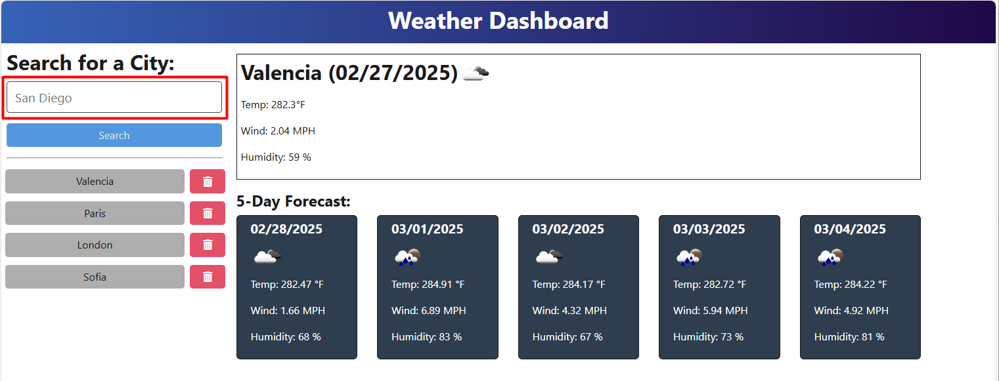
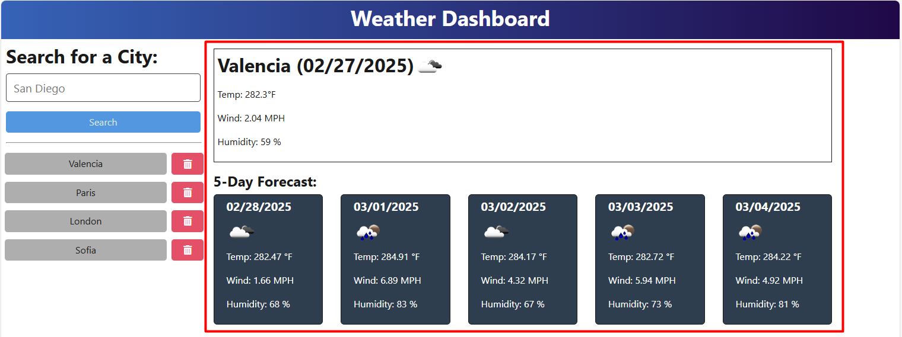
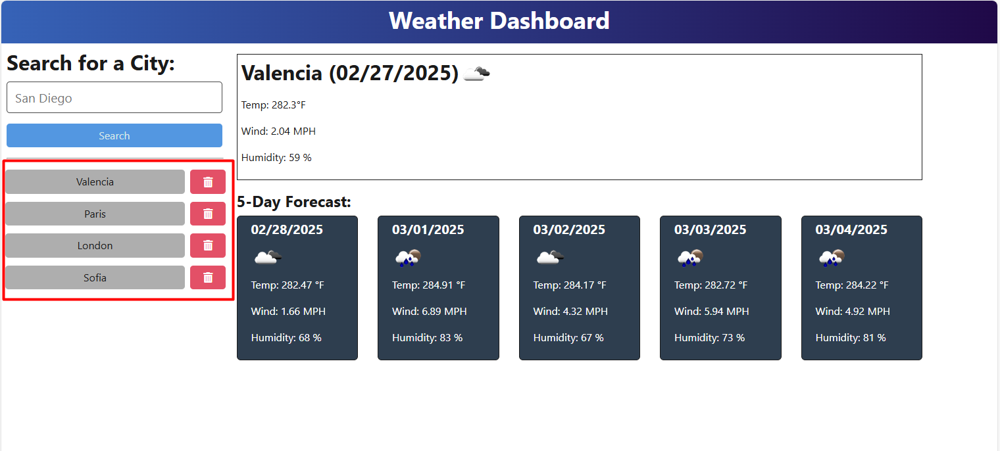
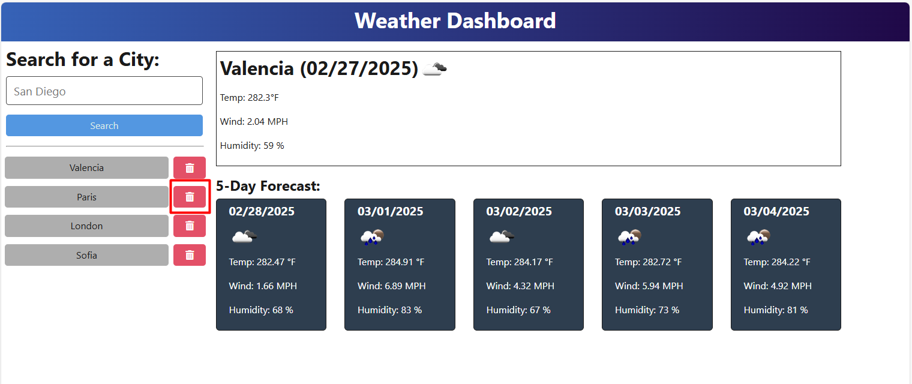

# 09 Servers and APIs: Weather Dashboard

**GitHub Repo:** https://github.com/antoninast/module-9-challenge-weather-dashboard

**Live URL:** https://module-9-challenge-weather-dashboard-1gzh.onrender.com

## Description
The Weather Dashboard website provides an intuitive platform for users to check the weather forecast for any city. By simply entering the name of the city in the search field, users will be able to view the current weather conditions as well as the forecast for the next five days, ensuring they have all the information they need for planning ahead.

In addition, the website automatically stores the cities you search for in your search history, allowing for quick and convenient access to previously checked locations. If you no longer wish to keep a particular city in your history, you have the option to delete it, ensuring your search history remains relevant and streamlined. This feature makes it easier to manage and navigate between multiple cities without the need to re-enter their names each time.

1. Enter the name of the city to view the weather forecast.

2. View the current weather conditions and the forecast for the next five days.

3. Search History.

4. The "Delete" button removes the city from your search history.

## Installation and setup
1. Clone the repo
2. Enter the main directory and run:
`npm install`

When the install finishes you are all set and you can run the application now.

3. In order to start the application you should run the following command in the main directory:
`npm run start:dev` or `npm run start`

